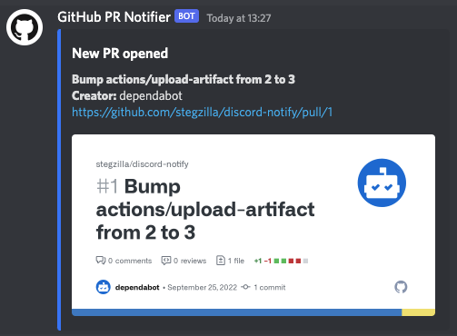

<p align="center">
  <a href="https://github.com/stegzilla/discord-notify/actions"></a>
</p>

# Discord Notify Action

This action sends a notification to Discord.

## Usage

| Input              |      Required      |  Default  | Description                                                                                                               |
| ------------------ | :----------------: | :-------: | ------------------------------------------------------------------------------------------------------------------------- |
| `webhook_url`      | :white_check_mark: |           | Webhook URL from Discord                                                                                                  |
| `title`            | :white_check_mark: |           | Title for card                                                                                                            |
| `message`          | :white_check_mark: |           | Content of card                                                                                                           |
| `include_image`    |                    |  `false`  | If action is used in a pull request, attach the preview image for it to the card. Can be overridden by `custom_image_url` |
| `colour`           |                    | `#3371FF` | Colour for the edge of the card in hex                                                                                    |
| `username`         |                    | `GitHub`  | Username to send message as                                                                                               |
| `avatar_url`       |                    |           | Avatar to use for user                                                                                                    |
| `custom_image_url` |                    |           | Attach custom image to card, overrides pull request image if set. Requires `include_image` to be `true`                   |
| `title_url`        |                    |           | Make the title of the card a link                                                                                         |

```yaml
name: 'New PR Notification'
on:
  pull_request: 
    types: [opened, reopened]

jobs:
  notify:
    runs-on: ubuntu-latest
    steps:
      - name: Send Discord notification
        uses: stegzilla/discord-notify@v2
        with:
          webhook_url: https://discord.com/api/webhooks/...
          title: New PR opened
          message: "**${{ github.event.pull_request.title }}**\n**Creator:** ${{ github.event.pull_request.user.login }}\n${{ github.event.pull_request.html_url }}"
          include_image: true
          avatar_url: https://github.githubassets.com/images/modules/logos_page/GitHub-Mark.png
          username: GitHub PR Notifier
```


